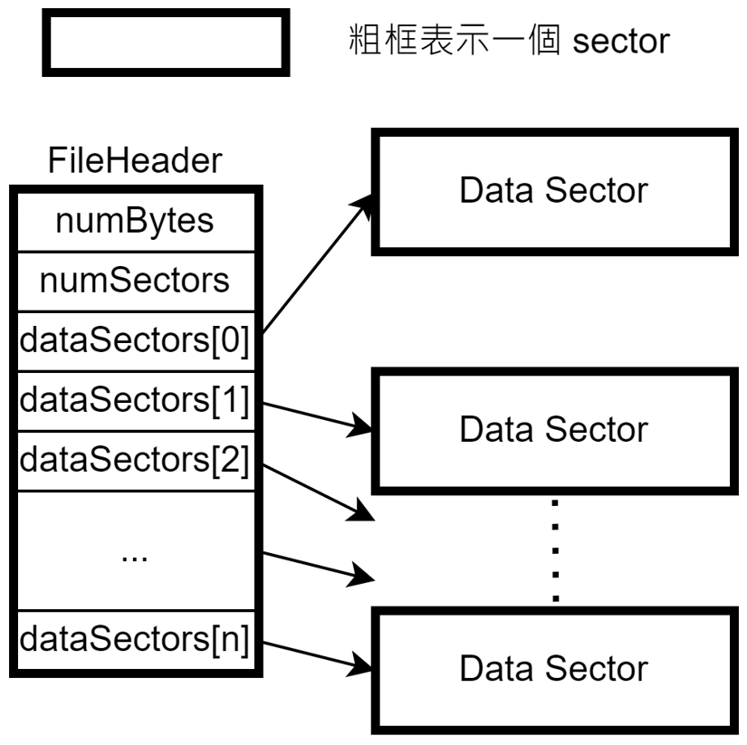
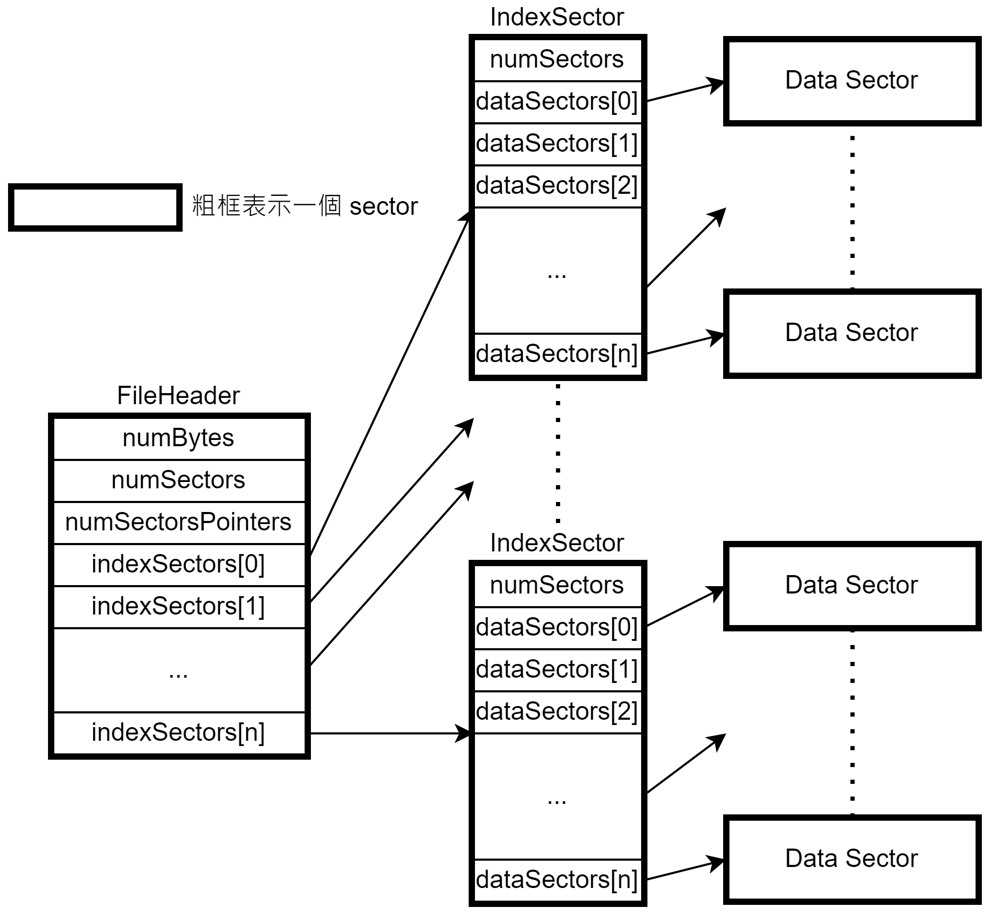

# OS MP4

## Part I
1. **How does the NachOS FS manage and find free block space? Where is this information stored on the raw disk (which sector)?**
NachOS 使用 bitmap 的方式來管理 block，如同上課內容中提到的 bit vector 的方式，每個 block 用一個 bit 去記錄是否已經被使用過。File system init 的時候，會將bitmap 開成一個 OpenFile 並寫回 disk，需要用到的時候就會用這個 OpenFile 來操作。每次 create a file 的時候，在 for-loop 中去使用 FindAndSet() 去搜尋有沒有足夠的 free block space 可以使用，有的話會將用到的 sector mark 起來，後會用 test 去檢查 sector 是否被標記，避免重複使用的問題，這個 bitmap table 被存放在 free map sector (sector 0)。

2. **What is the maximum disk size that can be handled by the current implementation? Explain why.**
最大支援 disk size 為 track 的數量乘以每個 track 有多少個 sector， NumSectors * SectorSize = 1024 * 128 = 2 ^ 17 bytes = 128 KiB，再加上檢查溢位的 magic number，最後的 maximum disk size = 128 KiB + 1 B。
    ```cpp
    const int SectorSize = 128;
    const int SectorsPerTrack  = 32;
    const int NumTracks = 32;
    const int NumSectors = (SectorsPerTrack * NumTracks);
    ```
    ```cpp
    const int MagicNumber = 0x456789ab;
    const int MagicSize = sizeof(int);
    const int DiskSize = (MagicSize + (NumSectors * SectorSize));
    ```

3. **How does the NachOS FS manage the directory data structure? Where is this information stored on the raw disk (which sector)?**
NachOS 的 file system 只使用一層的 directory entry table 存放檔案，和 bitmap 一樣，在 file system 初始化的時候會將 directory 開成一個 OpenFile 並寫回 disk，要用的時候就會去 fetch 這個 OpenFile 拿到 directory 的 structure。被存放在 directory sector (sector 1)。


4. **What information is stored in an inode? Use a figure to illustrate the disk allocation scheme of the current implementation.**
裡面有記錄檔案占用幾個 bytes (numBytes)，檔案占用幾個 sectors (numSectors)，還有檔案用了哪些 sectors (dataSectors)。
    ```cpp
    class FileHeader {
        ...
        private:
            int numBytes;
            int numSectors;
            int dataSectors[NumDirect];
    };
    ```
    


5. **What is the maximum file size that can be handled by the current implementation? Explain why.**
File header 結構為兩個 int 加上存放 int 的 sector table，因此在算能放幾個 sector 時，要用 SectorSize 減掉兩個 int，NumDirect 表示能夠存放 data 的 sector 數量，因此 max file size 是 NumDirect * SectorSize。NumDirect = 30，SectorSize = 128 bytes，MaxFileSize = 3840 bytes。
    ```cpp
    #define NumDirect ((SectorSize - 2 * sizeof(int)) / sizeof(int))
    #define MaxFileSize (NumDirect * SectorSize)
    ```
    
## Part II
原本的架構為 file header 的 sector 會有一個 table 去紀錄他會用到哪些 sector，因此單個檔案大小會受到一個 sector 的 size 限制，因此我們採取多加一層 indirect 的 reference 的方法，file header 的 table 會記錄他會用到哪些 index sector，然後每個 index sector 裡面會記錄這個 file 實際上用到 sector。



### IndexSector Class
我們幫 index sector 寫了一個新的 class，這樣比較好處理 index sector 的問題，大致上跟原本的 FileHeader 一樣，就是用來記錄 
direct sector table 的 class。
#### Class Structure
```cpp
class IndexSector {
    public:
    IndexSector();
    ~IndexSector();

    bool Allocate(PersistentBitmap *bitMap, int numSectors);
    void Deallocate(PersistentBitmap *bitMap);
    void FetchFrom(int sectorNumber);
    void WriteBack(int sectorNumber);
    int ByteToSector(int offset);
    int FileLength();
    void Print();
    int* getDataSectors() { return dataSectors; }
    int getNumSectors() { return numRealSectors; }

    private:
    int numRealSectors; // 用到幾個 sector
    int dataSectors[NumDirect]; // 記錄用到哪些 sector
};
```

#### IndexSector::Allocate
```cpp
bool IndexSector::Allocate(PersistentBitmap *freeMap, int nSectors) {
    if (freeMap->NumClear() < nSectors)
        return FALSE; // not enough space

    numRealSectors = nSectors;
    for (int i = 0; i < numRealSectors; i++) {
        dataSectors[i] = freeMap->FindAndSet();
        ASSERT(dataSectors[i] >= 0);
    }
    return TRUE;
}
```
其他的部分都跟原本的 FileHeader 一樣，沒有做任何修改。

### FileHeader Class
#### Class Structure

```cpp
class FileHeader {
    public:
    FileHeader();
    ~FileHeader();

    bool Allocate(PersistentBitmap *bitMap, int fileSize);
    void Deallocate(PersistentBitmap *bitMap);
    void FetchFrom(int sectorNumber);
    void WriteBack(int sectorNumber);
    int ByteToSector(int offset);
    int FileLength();
    void Print();

    private:
    int numBytes; // file size
    int numSectors; // 需要用到幾個 sector
    int numSectorsPointers; // 需要用幾個 index sector
    int indexSectors[NumIndirect]; // index sector 的 reference
    IndexSector indexSectorObjects[NumIndirect]; // in-core 才會用到，不會寫回 disk
};
```
#### Constructor
```cpp
FileHeader::FileHeader() {
    numBytes = -1;
    numSectors = -1;
    memset(indexSectors, -1, sizeof(indexSectors));
}
```
#### FileHeader::Allocate
```cpp
bool FileHeader::Allocate(PersistentBitmap *freeMap, int fileSize) {
    numBytes = fileSize;
    numSectors = divRoundUp(fileSize, SectorSize);
    numSectorsPointers = divRoundUp(numSectors, NumDirect);

    if (freeMap->NumClear() < numSectors + numSectorsPointers)
        return FALSE; // not enough space

    int remainNumSectors = numSectors;

    for (int i = 0; i < numSectorsPointers; i++) {
        // 建立 index sector
        indexSectors[i] = freeMap->FindAndSet();
        // 呼叫 IndexSector 的 allocate 去初始化 direct sector table
        if (remainNumSectors <= NumDirect) {
            indexSectorObjects[i].Allocate(freeMap, remainNumSectors);
            indexSectorObjects[i].WriteBack(indexSectors[i]);
            break;
        } else {
            indexSectorObjects[i].Allocate(freeMap, NumDirect);
            indexSectorObjects[i].WriteBack(indexSectors[i]);
            remainNumSectors -= NumDirect;
        }
    }
    return TRUE;
}
```
#### FileHeader::Deallocate
```cpp
void FileHeader::Deallocate(PersistentBitmap *freeMap) {
    for (int i = 0; i < numSectorsPointers; i++) {
        // 呼叫 IndexSector 裡面的 Deallocate 去釋放 data sector
        indexSectorObjects[i].Deallocate(freeMap);
        if (!freeMap->Test((int)indexSectors[i])) continue;
        // 釋放 index sector
        freeMap->Clear((int)indexSectors[i]);
    }
}
```
#### FileHeader::FetchFrom
```cpp
void FileHeader::FetchFrom(int sector) {
    // fetch file header sector
    kernel->synchDisk->ReadSector(sector, (char *)this);
    // fetch index sector
    for (int i = 0; i < numSectorsPointers; i++) {
        indexSectorObjects[i].FetchFrom(indexSectors[i]);
    }
}
```
#### FileHeader::WriteBack
```cpp
void FileHeader::WriteBack(int sector) {
    // 不用將 in-core 的 data 寫回去
    char buf[SectorSize];
    memcpy(buf, (char *)this, SectorSize);
    kernel->synchDisk->WriteSector(sector, buf);
    // 將 index sector 寫回 disk
    for (int i = 0; i < numSectorsPointers; i++) {
        indexSectorObjects[i].WriteBack(indexSectors[i]);
    }
}
```
#### FileHeader::ByteToSector
```cpp
int FileHeader::ByteToSector(int offset) {
    // 算出在第幾個 index sector
    int idx = offset / (SectorSize * NumDirect);
    // 呼叫下一層的 ByteToSector 得到檔案所在的 sector number
    int sector = indexSectorObjects[idx].ByteToSector(offset % (SectorSize * NumDirect));
    return sector;
}
```
---
以下是 system call 實作的部分，與 MP1 大致相仿。
#### exception.cc
```cpp
void ExceptionHandler(ExceptionType which) {
    int type = kernel->machine->ReadRegister(2);
    int val, arg1, arg2, arg3, arg4;
    int status, exit, threadID, programID;
    switch (which) {
    case SyscallException:
        switch (type) {
            case SC_Create:
                arg1 = kernel->machine->ReadRegister(4);
                arg2 = kernel->machine->ReadRegister(5);
                {
                    char *filename = &(kernel->machine->mainMemory[arg1]);
                    status = SysCreate(filename, arg2);
                    kernel->machine->WriteRegister(2, (int)status);
                }
                kernel->machine->WriteRegister(PrevPCReg, kernel->machine->ReadRegister(PCReg));
                kernel->machine->WriteRegister(PCReg, kernel->machine->ReadRegister(PCReg) + 4);
                kernel->machine->WriteRegister(NextPCReg, kernel->machine->ReadRegister(PCReg) + 4);
                return;
                ASSERTNOTREACHED();
                break;
            case SC_Open:
                arg1 = kernel->machine->ReadRegister(4);
                {
                    char *filename = &(kernel->machine->mainMemory[arg1]);
                    status = SysOpen(filename);
                    kernel->machine->WriteRegister(2, (int)status);
                }
                kernel->machine->WriteRegister(PrevPCReg, kernel->machine->ReadRegister(PCReg));
                kernel->machine->WriteRegister(PCReg, kernel->machine->ReadRegister(PCReg) + 4);
                kernel->machine->WriteRegister(NextPCReg, kernel->machine->ReadRegister(PCReg) + 4);
                return;
                ASSERTNOTREACHED();
                break;
            case SC_Write:
                arg1 = kernel->machine->ReadRegister(4);
                arg2 = kernel->machine->ReadRegister(5);
                arg3 = kernel->machine->ReadRegister(6);
                {
                    char *buffer = &(kernel->machine->mainMemory[arg1]);
                    status = SysWrite(buffer, arg2, arg3);
                    kernel->machine->WriteRegister(2, (int)status);
                }
                kernel->machine->WriteRegister(PrevPCReg, kernel->machine->ReadRegister(PCReg));
                kernel->machine->WriteRegister(PCReg, kernel->machine->ReadRegister(PCReg) + 4);
                kernel->machine->WriteRegister(NextPCReg, kernel->machine->ReadRegister(PCReg) + 4);
                return;
                ASSERTNOTREACHED();
                break;
            case SC_Read:
                arg1 = kernel->machine->ReadRegister(4);
                arg2 = kernel->machine->ReadRegister(5);
                arg3 = kernel->machine->ReadRegister(6);
                {
                    char *buffer = &(kernel->machine->mainMemory[arg1]);
                    status = SysRead(buffer, arg2, arg3);
                    kernel->machine->WriteRegister(2, (int)status);
                }
                kernel->machine->WriteRegister(PrevPCReg, kernel->machine->ReadRegister(PCReg));
                kernel->machine->WriteRegister(PCReg, kernel->machine->ReadRegister(PCReg) + 4);
                kernel->machine->WriteRegister(NextPCReg, kernel->machine->ReadRegister(PCReg) + 4);
                return;
                ASSERTNOTREACHED();
                break;
            case SC_Close:
                arg1 = kernel->machine->ReadRegister(4);
                status = SysClose(arg1);
                kernel->machine->WriteRegister(2, (int)status);
                kernel->machine->WriteRegister(PrevPCReg, kernel->machine->ReadRegister(PCReg));
                kernel->machine->WriteRegister(PCReg, kernel->machine->ReadRegister(PCReg) + 4);
                kernel->machine->WriteRegister(NextPCReg, kernel->machine->ReadRegister(PCReg) + 4);
                return;
                ASSERTNOTREACHED();
                break;
            ...
        }
        ...
    }
    ...
}
```
#### ksyscall.h
```cpp
int SysCreate(char *name, int size) {
    bool val = kernel->fileSystem->Create(name, size, FILE_TYPE);
    if (val) return 1;
    else return 0;
}

OpenFileId SysOpen(char *name) {
    return kernel->fileSystem->OpenAFile(name);
}

int SysWrite(char *buffer, int size, OpenFileId id) {
    return kernel->fileSystem->WriteFile(buffer, size, id);
}

int SysRead(char *buffer, int size, OpenFileId id) {
    return kernel->fileSystem->ReadFile(buffer, size, id);
}

int SysClose(OpenFileId id) {
    return kernel->fileSystem->CloseFile(id);
}
```
#### FileSystem Class
```cpp
class FileSystem {
    public:
        ...
        OpenFileId OpenAFile(char *name) {
            currOpenFile = Open(name);
            if (currOpenFile == NULL) return -1;
            return 1;
        }

        int WriteFile(char *buffer, int size, OpenFileId id) {
            if (id <= 0) return -1;
            if (currOpenFile == NULL) return -1;
            return currOpenFile->Write(buffer, size);
        }

        int ReadFile(char *buffer, int size, OpenFileId id) {
            if (id <= 0) return -1;
            if (currOpenFile == NULL) return -1;
            return currOpenFile->Read(buffer, size);
        }

        int CloseFile(OpenFileId id) {
            if (currOpenFile == NULL) return 1;
            delete currOpenFile;
            return 1;
        }

    private:
        OpenFile *freeMapFile;
        OpenFile *directoryFile;
        OpenFile *currOpenFile; // 記錄目前開啟的檔案
};
```
## Part III
我們做法的原則就是先用 change directory 到正確的路徑後再用原本 file system 的操作。
#### CreateDirectory
```cpp
static void CreateDirectory(char *name) {
    kernel->fileSystem->Create(name, DirectoryFileSize, DIRECTORY_TYPE);
}
```
#### 支援 64 個 directory
```cpp
#define NumDirEntries 64
```
#### FileSystem::ChangeDirectory
用遞迴的方法去取得正確的 directory。Path 傳法會像是 a/b/c -> b/c -> c。
```cpp
OpenFile* FileSystem::ChangeDirectory(char *path, OpenFile *directoryFile) {
    char* nextPath = strstr(path + 1, "/");
    if (nextPath == NULL) {
        return directoryFile;
    }

    // 修正要傳到下一層的 path
    char dirName[FileNameMaxLen + 1] = {0};
    strncpy(dirName, path, nextPath - path);

    Directory *directory = new Directory(NumDirEntries);
    directory->FetchFrom(directoryFile);
    int sector = directory->Find(dirName);
    if (sector == -1) {
        delete directory;
        return directoryFile;
    }
    OpenFile *newDirectoryFile = new OpenFile(sector);
    OpenFile *rt = ChangeDirectory(nextPath, newDirectoryFile);
    if (rt != newDirectoryFile) delete newDirectoryFile;
    delete directory;
    return rt;
}
```
#### FileSystem::Create
```cpp
bool FileSystem::Create(char *name, int initialSize, char type) {
    ...
    // 切換到正確的路徑
    OpenFile* destDirectoryFile = ChangeDirectory(name, directoryFile);
    directory = new Directory(NumDirEntries);
    directory->FetchFrom(destDirectoryFile);
    
    // 取得正確的 file 或 directory name (包含 '/')
    while (strstr(name, "/") != NULL) {
        name = strstr(name, "/") + 1;
    }
    name--;

    if (directory->Find(name) != -1) {
        success = FALSE; // file is already in directory
    }
    else {
        ...
    }
    return success;
}
```
#### FileSystem::Open
```cpp
OpenFile * FileSystem::Open(char *name) {
    // 切換到正確的 directory
    OpenFile* destDirectoryFile = ChangeDirectory(name, directoryFile);
    Directory *directory = new Directory(NumDirEntries);
    OpenFile *openFile = NULL;
    int sector;

    DEBUG(dbgFile, "Opening file" << name);
    directory->FetchFrom(destDirectoryFile);
    // 取得正確的 file 或 directory name (包含 '/')
    while (strstr(name, "/") != NULL) {
        name = strstr(name, "/") + 1;
    }
    name--;
    sector = directory->Find(name);
    ...
    return openFile; // return NULL if not found
}
```
#### FileSystem::Remove
這個部分我們有實作 bonus 要求的功能，因此這裡先省略。
#### FileSystem::List
我們有修改外層使用 -l, -lr 指令後傳進來的參數，recursiveListFlag 表示需不需要遞迴，path 表示想要查找的路徑。
```cpp
void FileSystem::List(char* path, bool recursiveListFlag) {
    Directory *directory = new Directory(NumDirEntries);
    OpenFile* destDirectoryFile = directoryFile;
    
    // 如果不是查找 root directory
    if (strcmp(path, "/") != 0) {
        // 切換路徑
        destDirectoryFile = ChangeDirectory(path, directoryFile);
        directory->FetchFrom(destDirectoryFile);
        // 切換到想要查找的 directory
        int sector = directory->Find(path);
        if (sector == -1) {
            delete directory;
            return;
        }
        destDirectoryFile = new OpenFile(sector);
    }
    directory->FetchFrom(destDirectoryFile);
    // 呼叫 Directory 的 List
    // 將 level = 0 和 recursiveListFlag 傳入
    directory->List(0, recursiveListFlag);
    delete directory;
}
```
#### DirectoryEntry Class
```cpp
class DirectoryEntry {
public:
    char type; // 記錄是 directory, file, 還是其他 type
    ...
};
```
#### Directory::List
```cpp
void Directory::List(int level, bool recursiveListFlag) {
    // type 要對才印出名字
    for (int i = 0; i < tableSize; i++) {
        if ((table[i].type == FILE_TYPE || table[i].type == DIRECTORY_TYPE) && table[i].inUse) {
            for (int j = 0; j < level; j++) printf("    ");
            if (recursiveListFlag && table[i].type == FILE_TYPE) printf("[F] ");
            else if (recursiveListFlag && table[i].type == DIRECTORY_TYPE) printf("[D] ");
            printf("%s\n", table[i].name + 1);
            
            // 是 directory 的話才會繼續查找
            if (recursiveListFlag == TRUE && table[i].type == DIRECTORY_TYPE) {
                OpenFile* file = new OpenFile(table[i].sector);
                Directory* directory = new Directory(tableSize);
                directory->FetchFrom(file);
                directory->List(level + 1, DIRECTORY_TYPE);
                delete directory;
                delete file;
            }
        }
    }
}
```
## Bonus
### Recursively Remove
與 Part III 的想法一樣，先切換到正確的路徑再操作，將 FileSystem 的 Remove 改成遞迴的方式，找到最底端開始 remove，慢慢一層一層 remove 回來。
#### Remove
```cpp
bool FileSystem::Remove(char *name)
{
    Directory *directory;
    PersistentBitmap *freeMap;
    FileHeader *fileHdr;
    int sector;

    // 切換到正確的路徑
    OpenFile* destDirectoryFile = directoryFile;
    if (strcmp(name, "/") != 0) {
        destDirectoryFile = ChangeDirectory(name, directoryFile);
    }
    directory = new Directory(NumDirEntries);
    directory->FetchFrom(destDirectoryFile);
    
    // 記下原本的絕對路徑
    char* originalName = name;

    while (strstr(name, "/") != NULL) {
        name = strstr(name, "/") + 1;
    }
    name--;
    sector = directory->Find(name);

    if (sector == -1) {
        delete directory;
        return FALSE; // file not found
    }

    // 取得要 recursive 刪除的 root path
    OpenFile *newDirectoryFile = new OpenFile(sector);
    Directory *newDirectory = new Directory(NumDirEntries);
    newDirectory->FetchFrom(newDirectoryFile);

    DirectoryEntry* table = newDirectory->GetTable();
    
    // 搜尋這個路徑的 subdirectory
    for (int i = 0; i < NumDirEntries; i++) {
        if (table[i].inUse && (table[i].type == DIRECTORY_TYPE || table[i].type == FILE_TYPE)) {
            // 取得正要傳給下一個 remove 用的絕對路徑
            int len_originalName = strlen(originalName);
            int len_tableIName = strlen(table[i].name);
            char* childPath = NULL;
            if (len_originalName == 1) {
                childPath = new char[len_tableIName + 1];
                memset(childPath, 0, len_tableIName + 1);
                strcpy(childPath, table[i].name);
            } else {
                childPath = new char[len_originalName + len_tableIName + 2];
                memset(childPath, 0, len_originalName + len_tableIName + 2);
                strcpy(childPath, originalName);
                strcpy(childPath + len_originalName, table[i].name);
            }
            // call Remove recursively
            if (!Remove(childPath)) {
                delete directory;
                delete[] childPath;
                return FALSE;
            }
            delete[] childPath;
        }
    }

    fileHdr = new FileHeader;
    fileHdr->FetchFrom(sector);
    ...
    return TRUE;
}
```