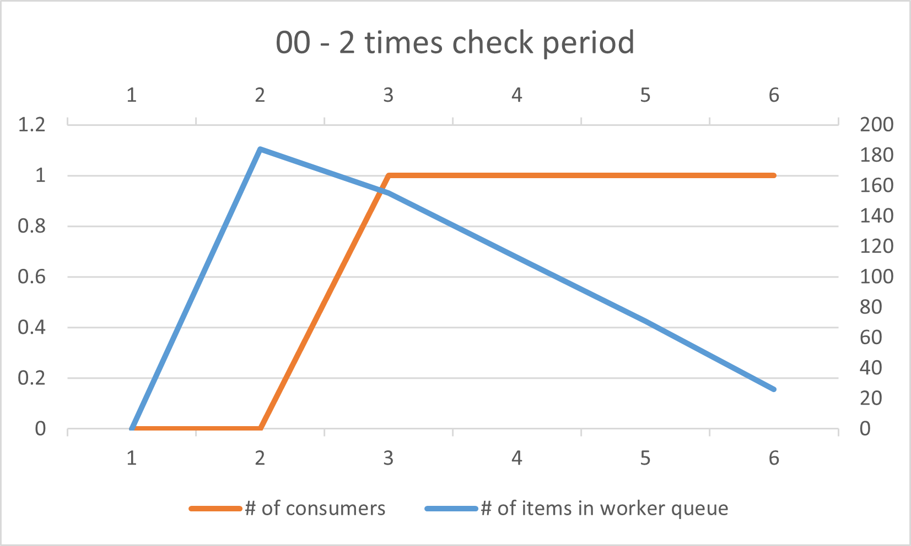
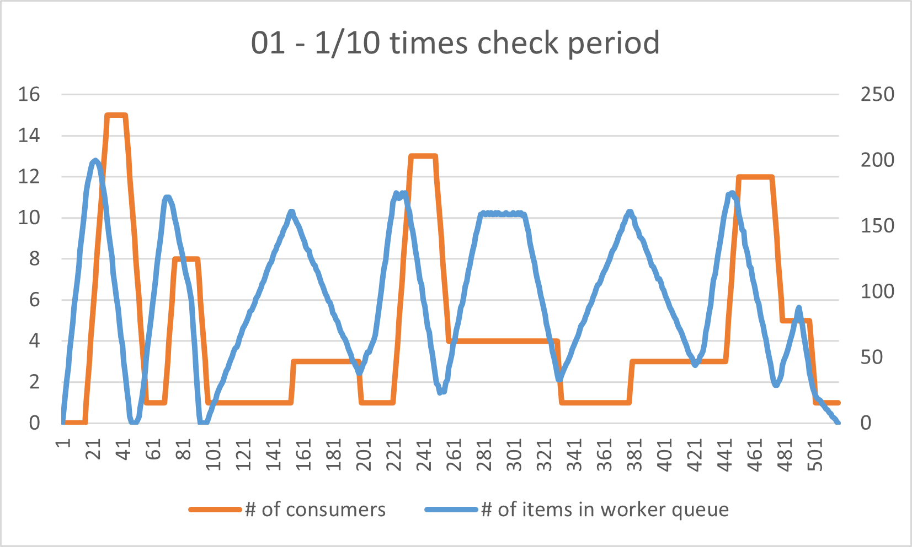

# OS Pthread

## Implementation
```cpp
int main(int argc, char** argv) {
    assert(argc == 4);

    int n = atoi(argv[1]);
    std::string input_file_name(argv[2]);
    std::string output_file_name(argv[3]);

    TSQueue<Item*> reader_queue(READER_QUEUE_SIZE);
    TSQueue<Item*> worker_queue(WORKER_QUEUE_SIZE);
    TSQueue<Item*> writer_queue(WRITER_QUEUE_SIZE);
	Transformer transformer;
	// TODO: implements main function
	Reader* reader = new Reader(n, input_file_name, &reader_queue/*, &reader_finish*/);
	Producer* producer1 = new Producer(&reader_queue, &worker_queue, &transformer/*, &reader_finish*/);
    Producer* producer2 = new Producer(&reader_queue, &worker_queue, &transformer/*, &reader_finish*/);
    Producer* producer3 = new Producer(&reader_queue, &worker_queue, &transformer/*, &reader_finish*/);
    Producer* producer4 = new Producer(&reader_queue, &worker_queue, &transformer/*, &reader_finish*/);
	Writer* writer = new Writer(n, output_file_name, &writer_queue);
	ConsumerController* consumer_controller = new ConsumerController(
        &worker_queue, 
        &writer_queue, 
        &transformer, 
        CONSUMER_CONTROLLER_LOW_THRESHOLD_PERCENTAGE, 
        CONSUMER_CONTROLLER_HIGH_THRESHOLD_PERCENTAGE, 
        CONSUMER_CONTROLLER_CHECK_PERIOD
    );
    //std::cout << "define threads" << std::endl;
    reader->start();
    
    producer1->start();
    producer2->start();
    producer3->start();
    producer4->start();
    consumer_controller->start();
    //./main 200 ./tests/00.in ./tests/00.out

    writer->start();
    //std::cout << "start threads" << std::endl;
	reader->join();
    //std::cout << "reader finish" << std::endl;
    // producer1->join();
    // std::cout << "producer1 finish" << std::endl;
    // producer2->join();
    // producer3->join();
    // producer4->join();
    // consumer_controller->join();
    //./scripts/verify--output ./tests/00.out--answer ./tests/00.ans
    //std::cout << "consumer_controller finish" << std::endl;
    writer->join();
    //std::cout << "writer finish" << std::endl;
    //std::cout << "threads finish" << std::endl;
    // Clean up resources
    delete reader;
    delete producer1;
    delete producer2;
    delete producer3;
    delete producer4;
    delete consumer_controller;
    delete writer;

	return 0;
}

```
### 

### producer
```cpp
void Producer::start() {
    // TODO: starts a Producer thread
    pthread_create(&t, 0, Producer::process, (void*)this);
}

void* Producer::process(void* arg) {
    // TODO: implements the Producer's work
    Producer* producer = (Producer*)arg;
    
    while(true) {
	Item * item = producer->input_queue->dequeue();    
	item->val = producer->transformer->producer_transform(item->opcode, item->val);
	producer->worker_queue->enqueue(item);
    }
    return nullptr;
}
```

### consumer_controller
```cpp
void ConsumerController::start() {
    // TODO: starts a ConsumerController thread
    pthread_create(&t, 0, ConsumerController::process, (void*)this);
}

void* ConsumerController::process(void* arg) {
    // Cast the argument to ConsumerController
    ConsumerController* controller = static_cast<ConsumerController*>(arg);
    while (true) {
        // Get the current size of the worker queue
        int worker_queue_size = controller->worker_queue->get_size();
        if (worker_queue_size > controller->worker_queue->buffer_size * controller->high_threshold / 100){
            // Add a new consumer
            Consumer* new_consumer = new Consumer(
                controller->worker_queue,
                controller->writer_queue,
                controller->transformer
            );

            new_consumer->start(); // Start the consumer thread
            controller->consumers.push_back(new_consumer);
            
            std::cout << "Scaling up consumers from "<< controller->consumers.size() - 1 <<  " to " << controller->consumers.size() << std::endl;
        }
        // Scale down consumers if the worker queue falls below the low threshold
        else if (worker_queue_size < controller->worker_queue->buffer_size * controller->low_threshold / 100 && controller->consumers.size() > 1) {
            // Remove the most recently added consumer
            Consumer* last_consumer = controller->consumers.back();
            last_consumer->cancel(); // Cancel the consumer thread
            last_consumer->join();   // Wait for the thread to finish
            //delete last_consumer;    // Free memory

            controller->consumers.pop_back();
            std::cout << "Scaling down consumers from "<< controller->consumers.size() + 1 <<  " to " << controller->consumers.size() << std::endl;
            
        }

        // Ensure there is always at least one consumer
        

        // Sleep for the check period
        usleep(controller->check_period);
    }
    return nullptr;
}
```
### consumer
```cpp
void Consumer::start() {
    // TODO: starts a Consumer thread
    pthread_create(&t, 0, Consumer::process, (void*)this);
}

int Consumer::cancel() {
    is_cancel = true;
    return 0;
}

void* Consumer::process(void* arg) {
    Consumer* consumer = (Consumer*)arg;
    pthread_setcanceltype(PTHREAD_CANCEL_DEFERRED, nullptr);
    while (!consumer->is_cancel) {
        // TODO: implements the Consumer's work
        pthread_setcancelstate(PTHREAD_CANCEL_DISABLE, nullptr);
        Item *item = consumer->worker_queue->dequeue();
        item->val = consumer->transformer->consumer_transform(item->opcode, item->val);
        consumer->output_queue->enqueue(item);
        pthread_setcancelstate(PTHREAD_CANCEL_ENABLE, nullptr);
    }
    delete consumer;
    return nullptr;
}
```
### writer
```cpp
void Writer::start() {
    // TODO: starts a Writer thread
    pthread_create(&t, 0, Writer::process, (void*)this);
}

void* Writer::process(void* arg) {
    // TODO: implements the Writer's work
    Writer* writer = (Writer*)arg;
    while(writer->expected_lines--){
        Item* item = writer->output_queue->dequeue();
        writer->ofs << *item; 
        delete item; 
    }
    return nullptr;
}
```
## Experiment

### Different values of CONSUMER_CONTROLLER_CHECK_PERIOD
#### Discussion
減少 check period time 可以更及時的分配資源，因此可以增快執行速度，但是太過頻繁的檢查並調度也會花費更多的時間，因此可以在 test 01 1/10 times check period 的測試中看到，其執行速度沒有比 1/2 times check period 的速度更快，因此 check period time 應該是有一個最佳表現區間，太大或太小都會導致執行速度低落。
#### Result
- **test 00**

    | Check period | Runtime |
    | :--------: | :--------: |
    | 2 times | 11.1133 |
    | 1 times | 7.25883 |
    | 1/2 times | 5.39247 |
    | 1/10 times | 3.46049 |

    
    
    
    
    
- **test 01**

    | Check period | Runtime |
    | :--------: | :--------: |
    | 2 times | 68.8665 |
    | 1 times | 59.7507 |
    | 1/2 times | 52.8105 |
    | 1/10 times | 52.8789 |

    
    
    
    

### Different values of CONSUMER_CONTROLLER_LOW_THRESHOLD_PERCENTAGE and CONSUMER_CONTROLLER_HIGH_THRESHOLD_PERCENTAGE

#### Discussion
從 test 00 看起來，較小的 min threshold 與較小的 max threshold 執行速度更快，但當數量放大之後，從 test 01 的結果可以看出，這兩個 threshold 的設置對於執行速度上的影響甚微。
#### Result
- **test 00**

    | Threshold (min, max) | Runtime |
    | :--------: | :-----: |
    | (40%, 60%) | 6.17829 |
    | (20%, 80%) | 7.25883 |
    | (20%, 60%) | 5.77848 |
    | (40%, 80%) | 8.25213 |

    
    
    
    
    
- **test 01**

    | Threshold (min, max) | Runtime |
    | :--------: | :-----: |
    | (40%, 60%) | 58.9171 |
    | (20%, 80%) | 59.7507 |
    | (20%, 60%) | 58.7007 |
    | (40%, 80%) | 59.7340 |

    
    
    
    

 
### Different values of WORKER_QUEUE_SIZE

#### Discussion
Worker queue size 設定的大一點，雖然能增加處理更多 items 的能力，但當 work queue size 太大的時候會導致 consumer controler 沒有創建 consumer 或是 consumer 數量增長延遲的情況。
#### Result
- **test 00**

    | Work queue size | Runtime |
    | :--------: | :-----: |
    | 2 times | Infinity (never end) |
    | 1 times | 7.25883 |
    | 1/2 times | 4.77562 |

    
    
    
- **test 01**

    | Work queue size | Runtime |
    | :--------: | :-----: |
    | 2 times | 60.4075 |
    | 1 times | 59.7507 |
    | 1/2 times | 56.7949 |

    
    
    

### What happens if WRITER_QUEUE_SIZE is very small?

#### Discussion
:::warning
好像不會怎樣？
:::
#### Result


### What happens if READER_QUEUE_SIZE is very small?

#### Discussion
:::warning
好像不會怎樣？
:::
#### Result
