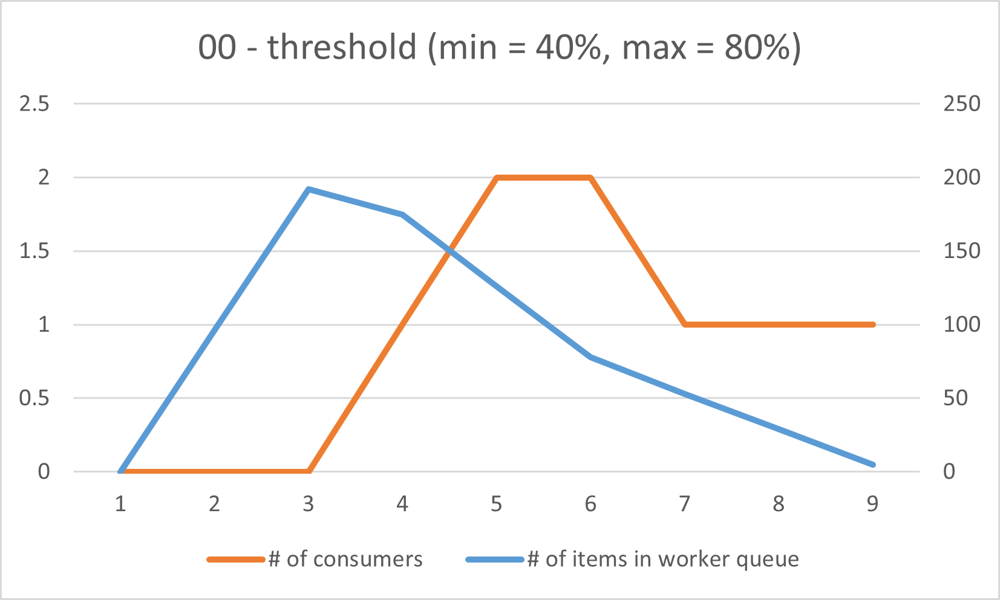
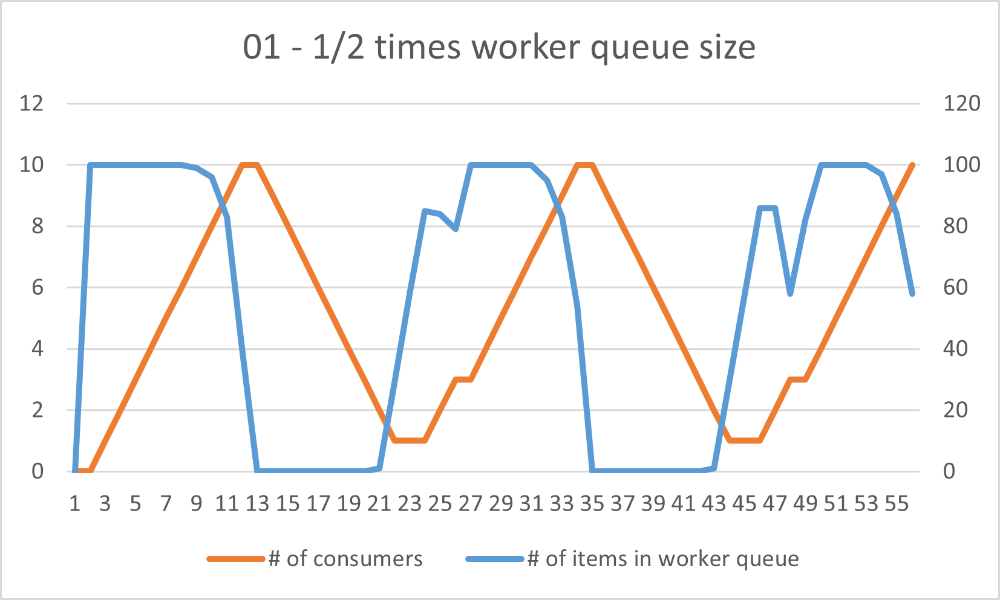

# OS Pthread

## Implementation
### main
```cpp
int main(int argc, char** argv) {
    assert(argc == 4);

    int n = atoi(argv[1]);
    std::string input_file_name(argv[2]);
    std::string output_file_name(argv[3]);

    TSQueue<Item*> reader_queue(READER_QUEUE_SIZE);
    TSQueue<Item*> worker_queue(WORKER_QUEUE_SIZE);
    TSQueue<Item*> writer_queue(WRITER_QUEUE_SIZE);
    Transformer transformer;
    // TODO: implements main function
    Reader* reader = new Reader(n, input_file_name, &reader_queue);
    Producer* producer1 = new Producer(&reader_queue, &worker_queue, &transformer);
    Producer* producer2 = new Producer(&reader_queue, &worker_queue, &transformer);
    Producer* producer3 = new Producer(&reader_queue, &worker_queue, &transformer);
    Producer* producer4 = new Producer(&reader_queue, &worker_queue, &transformer);
    Writer* writer = new Writer(n, output_file_name, &writer_queue);
    ConsumerController* consumer_controller = new ConsumerController(
        &worker_queue, 
        &writer_queue, 
        &transformer, 
        CONSUMER_CONTROLLER_LOW_THRESHOLD_PERCENTAGE, 
        CONSUMER_CONTROLLER_HIGH_THRESHOLD_PERCENTAGE, 
        CONSUMER_CONTROLLER_CHECK_PERIOD
    );

    reader->start();
    
    producer1->start();
    producer2->start();
    producer3->start();
    producer4->start();
    
    consumer_controller->start();

    writer->start();

    reader->join();
    
    writer->join();

    // Clean up resources
    delete reader;
    delete producer1;
    delete producer2;
    delete producer3;
    delete producer4;
    delete consumer_controller;
    delete writer;

    return 0;
}

```
首先根據設置好的queue_size宣告reader_queue, worker_queue 以及 output_queue。接著創建 Reader, Producers, Consumer_controller 以及 Writer，依序開始執行。最後等待 Reader 及 Writer 執行結束並釋放資源。
### Ts_Queue
#### TSQueue<T\>::TSQueue
TSQueue的建構子，初始化各個變數。
```cpp
template <class T>
TSQueue<T>::TSQueue(int buffer_size) : buffer_size(buffer_size) {
    // TODO: implements TSQueue constructor
    this->buffer = new T[this->buffer_size];	
    //this->buffer_size = 0;
    this->head = 0;
    this->size = 0;
    this->tail = 0;
    pthread_mutex_init(&this->mutex, nullptr);
    pthread_cond_init(&this->cond_enqueue, nullptr);
    pthread_cond_init(&this->cond_dequeue, nullptr);
}
```
    
#### TSQueue<T\>::~TSQueue
TSQueue的解構子，釋放各個變數的資源。
```cpp
template <class T>
TSQueue<T>::~TSQueue() {
    // TODO: implenents TSQueue destructor
    delete[] buffer;
    pthread_mutex_destroy(&this->mutex);
    pthread_cond_destroy(&this->cond_enqueue);
    pthread_cond_destroy(&this->cond_dequeue);
}
```

#### TSQueue<T\>::enqueue
首先,取得 lock 以避免其他 threads 同時對 queue 進行操作。若 queue 為滿的狀態，則呼叫 pthread_cond_wait(&this->cond_enqueue, &this->mutex)，等待其他 threads 進行 dequeue 後 signal。若 queue 仍有空間，則將 item 放入最後端(head處)，並更新 size 及 head 的值(這邊採用的是 circular queue)。
```cpp
template <class T>
void TSQueue<T>::enqueue(T item) {
    // TODO: enqueues an element to the end of the queue
    pthread_mutex_lock(&this->mutex); 
    while(this->head == this->tail && this->size == this->buffer_size) {
        pthread_cond_wait(&this->cond_enqueue, &this->mutex);
    }
    this->buffer[this->head] = item;
    this->head = (this->head + 1) % this->buffer_size;
    this->size++;
    pthread_cond_signal(&this->cond_dequeue);
    pthread_mutex_unlock(&this->mutex);
}
```

#### TSQueue<T\>::dequeue
首先,取得 lock 以避免其他 threads 同時對 queue 進行操作。若 queue 為空，則呼叫 pthread_cond_wait(&this->cond_dequeue, &this->mutex)，等待其他 threads 進行 enqueue 後 signal。若仍有 items 在 queue 之中，則將最前端的 item 取出(tail處)，更新 size 及 tail 的值(這邊採用的是 circular queue)，最後將取出的 item 回傳。
```cpp
template <class T>
TSQueue<T>::dequeue() {
    // TODO: dequeues the first element of the queue
    pthread_mutex_lock(&this->mutex);
    while(this->tail == this->head  && this->size == 0){
        pthread_cond_wait(&this->cond_dequeue, &this->mutex);
    }
    T item = this->buffer[this->tail];
    this->tail = (this->tail + 1) % this->buffer_size;
    this->size--;
    pthread_cond_signal(&this->cond_enqueue);
    pthread_mutex_unlock(&this->mutex);
    return item;
}
```

#### TSQueue<T\>::get_size
回傳 private 變數 size，用以取得目前 queue 中 item 的數量。
```cpp
template <class T>
int TSQueue<T>::get_size() {
    // TODO: returns the size of the queue
    pthread_mutex_lock(&mutex);
    int current_size = this->size;
    pthread_mutex_unlock(&mutex);
    return current_size;
}
```

### Reader
#### No implement
根據 expected_lines，依次從檔案流(ifs)中讀取指定行數的資料。為每一行資料動態分配一個 Item 物件，並將初始化完成的 Item 放入input_queue，供後續處理使用(enqueue)。
```cpp
void* Reader::process(void* arg) {
    Reader* reader = (Reader*)arg;
    while (reader->expected_lines--) {
        Item *item = new Item;
        reader->ifs >> *item;
        reader->input_queue->enqueue(item);
    }
    return nullptr;
}
```


### Producer

#### Producer::start
創建執行 Producer::process 的 Producer thread
```cpp
void Producer::start() {
    // TODO: starts a Producer thread
    pthread_create(&t, 0, Producer::process, (void*)this);
}
```

#### Producer::process
從 input_queue 中 dequeue，取出最前端的item。接著將 item->opcode 及 item->val 傳入 producer_transform 並將 item->val 更新為回傳值。最後，將 item 放入 worker_queue 中(enqueue)。
```cpp
void* Producer::process(void* arg) {
    // TODO: implements the Producer's work
    Producer* producer = (Producer*)arg;
    
    while(true) {
	Item * item = producer->input_queue->dequeue();    
	item->val = producer->transformer->producer_transform(item->opcode, item->val);
	producer->worker_queue->enqueue(item);
    }
    return nullptr;
}
```


### Consumer_controller

#### ConsumerController::start
創建執行 ConsumerController::process 的 ConsumerController thread
```cpp
void ConsumerController::start() {
    // TODO: starts a ConsumerController thread
    pthread_create(&t, 0, ConsumerController::process, (void*)this);
}
```

#### ConsumerController::process
每 CONSUMER_CONTROLLER_CHECK_PERIOD 微秒檢查一次 worker_queue 的狀態。如果 worker_queue 中 item 的數量超過 high_threshold(%)，則創建一個新的 Consumer thread 來處理工作。反之，如果 worker_queue 中 item 的數量低於 low_threshold(%)，則將最新創建的 Consumer thread 砍掉（透過呼叫 Consumer->cancel 方法），此時須確保至少仍有一個 Consumer 在運作。其中，我們使用 ConsumerController::consumers  來紀錄目前正在執行的 Consumer 清單，確保其狀態正確。
```cpp
void* ConsumerController::process(void* arg) {
    // Cast the argument to ConsumerController
    ConsumerController* controller = static_cast<ConsumerController*>(arg);
    while (true) {
        // Get the current size of the worker queue
        int worker_queue_size = controller->worker_queue->get_size();
        if (worker_queue_size > controller->worker_queue->buffer_size * controller->high_threshold / 100){
            // Add a new consumer
            Consumer* new_consumer = new Consumer(
                controller->worker_queue,
                controller->writer_queue,
                controller->transformer
            );

            new_consumer->start(); // Start the consumer thread
            controller->consumers.push_back(new_consumer);
            
            std::cout << "Scaling up consumers from "<< controller->consumers.size() - 1 <<  " to " << controller->consumers.size() << std::endl;
        }
        // Scale down consumers if the worker queue falls below the low threshold
        else if (worker_queue_size < controller->worker_queue->buffer_size * controller->low_threshold / 100 && controller->consumers.size() > 1) {
            // Remove the most recently added consumer
            Consumer* last_consumer = controller->consumers.back();
            last_consumer->cancel(); // Cancel the consumer thread
            last_consumer->join();   // Wait for the thread to finish
            //delete last_consumer;    // Free memory

            controller->consumers.pop_back();
            std::cout << "Scaling down consumers from "<< controller->consumers.size() + 1 <<  " to " << controller->consumers.size() << std::endl;
            
        }

        // Ensure there is always at least one consumer
        

        // Sleep for the check period
        usleep(controller->check_period);
    }
    return nullptr;
}
```

### Consumer
#### Consumer::start
創建執行 Consumer::process 的 consumer thread
```cpp
void Consumer::start() {
    // TODO: starts a Consumer thread
    pthread_create(&t, 0, Consumer::process, (void*)this);
}
```

#### Consumer::cancel
將 consumer 中的 is_cancel 設為 true，代表該 consumer 即將被砍掉。
```cpp
int Consumer::cancel() {
    is_cancel = true;
    return 0;
}
```

#### Consumer::process
將 thread 的取消型態設定為「延遲型」（PTHREAD_CANCEL_DEFERRED），表示 thread 僅在安全點（如 pthread_testcancel）檢查取消請求。

在 consumer 處理工作項目時(consumer->is_cancel == false)禁用取消狀態，確保工作不會在處裡過程中因 thread 被取消而被中斷。
    
若 consumer->is_cancel 為 false，則從 worker_queue 中 dequeue，取出最前端的item。接著將 item->opcode 及 item->val 傳入 consumer_transform 並將 item->val 更新為回傳值。最後，將 item 放入 output_queue 中(enqueue)。
    
在完成工作邏輯後將 thread 恢復到可以取消的狀態，使其能夠接收取消請求。
```cpp
void* Consumer::process(void* arg) {
    Consumer* consumer = (Consumer*)arg;
    pthread_setcanceltype(PTHREAD_CANCEL_DEFERRED, nullptr);
    while (!consumer->is_cancel) {
        // TODO: implements the Consumer's work
        pthread_setcancelstate(PTHREAD_CANCEL_DISABLE, nullptr);
        Item *item = consumer->worker_queue->dequeue();
        item->val = consumer->transformer->consumer_transform(item->opcode, item->val);
        consumer->output_queue->enqueue(item);
        pthread_setcancelstate(PTHREAD_CANCEL_ENABLE, nullptr);
    }
    delete consumer;
    return nullptr;
}
```

### Writer

#### Writer::start
創建執行 Writer::process 的 writer thread
```cpp
void Writer::start() {
    // TODO: starts a Writer thread
    pthread_create(&t, 0, Writer::process, (void*)this);
}
```

#### Writer::process
從 output_queue 中 dequeue，取出最前端的item。接著將 item 傳入輸出流(ofs)中輸出。
```cpp
void* Writer::process(void* arg) {
    // TODO: implements the Writer's work
    Writer* writer = (Writer*)arg;
    while(writer->expected_lines--){
        Item* item = writer->output_queue->dequeue();
        writer->ofs << *item; 
        delete item; 
    }
    return nullptr;
}
```

## Experiment

### Different values of CONSUMER_CONTROLLER_CHECK_PERIOD
#### Discussion
減少 check period time 可以更及時的分配資源，因此可以增快執行速度，但是太過頻繁的檢查並調度也會花費更多的時間，因此可以在 test 01 1/10 times check period 的測試中看到，其執行速度沒有比 1/2 times check period 的速度更快，因此 check period time 應該是有一個最佳表現區間，太大或太小都會導致執行速度低落。
#### Result
- **test 00 Runtime**

    | Check period | Runtime |
    | :--------: | :--------: |
    | 2 times | 11.1133 |
    | 1 times | 7.25883 |
    | 1/2 times | 5.39247 |
    | 1/10 times | 3.46049 |
    
- **test 01 Runtime**

    | Check period | Runtime |
    | :--------: | :--------: |
    | 2 times | 68.8665 |
    | 1 times | 59.7507 |
    | 1/2 times | 52.8105 |
    | 1/10 times | 52.8789 |

- **test 00 Figures**

    
    
    
    

- **test 01 Figures**

    
    
    
    

### Different values of CONSUMER_CONTROLLER_LOW_THRESHOLD_PERCENTAGE and CONSUMER_CONTROLLER_HIGH_THRESHOLD_PERCENTAGE

#### Discussion
從 test 00 看起來，較小的 min threshold 與較小的 max threshold 執行速度更快，但當數量放大之後，從 test 01 的結果可以看出，這兩個 threshold 的設置對於執行速度上的影響甚微。
#### Result
- **test 00 Runtime**

    | Threshold (min, max) | Runtime |
    | :--------: | :-----: |
    | (40%, 60%) | 6.17829 |
    | (20%, 80%) | 7.25883 |
    | (20%, 60%) | 5.77848 |
    | (40%, 80%) | 8.25213 |
    
- **test 01 Runtime**

    | Threshold (min, max) | Runtime |
    | :--------: | :-----: |
    | (40%, 60%) | 58.9171 |
    | (20%, 80%) | 59.7507 |
    | (20%, 60%) | 58.7007 |
    | (40%, 80%) | 59.7340 |

- **test 00 Figures**

    
    
    
    

- **test 01 Figures**

    
    
    
    

 
### Different values of WORKER_QUEUE_SIZE

#### Discussion
Worker queue size 設定的大一點，雖然能增加處理更多 items 的能力，但當 work queue size 太大的時候會導致 consumer controler 沒有創建 consumer 或是 consumer 數量增長延遲的情況。
#### Result
- **test 00 Runtime**

    | Work queue size | Runtime |
    | :--------: | :-----: |
    | 2 times | Infinity (never end) |
    | 1 times | 7.25883 |
    | 1/2 times | 4.77562 |
    
- **test 01 Runtime**

    | Work queue size | Runtime |
    | :--------: | :-----: |
    | 2 times | 60.4075 |
    | 1 times | 59.7507 |
    | 1/2 times | 56.7949 |

- **test 00 Figures**

    
    

- **test 01 Figures**

    
    
    

### What happens if WRITER_QUEUE_SIZE is very small?
1/4 times original writer queue size
#### Discussion
:::warning
好像不會怎樣？
:::
#### Result


### What happens if READER_QUEUE_SIZE is very small?
1/4 times original reader queue size
#### Discussion
:::warning
好像不會怎樣？
:::
#### Result

    
## What difficulties did you encounter when implementing this assignment?
    
## feedback
        